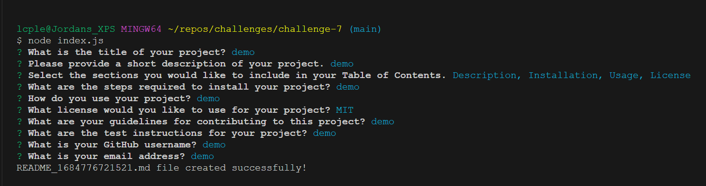

# Professional README Generator

## Description

My motivation for building this project was to build a Readme generator that ill be able to use from here on out with this course and in the future in a career.This project allowed me to learn new skills that ill be able to use in the future in a career setting or to build my own app in the future. At first this project seemed difficult to understand on how to get started and why and how it would be useful. After building this ive seen that using this is much easier then searching the internet for a readme template and copying it over then having to go through and write everything into it. Now im able to do this through this generator and write it as i go and pick what sections that i want or are needed for the project. This was a very good project to build and to learn. Hope you enjoy!!

## Usage

Open your terminal and type 'node index.js' and follow the prompts.
